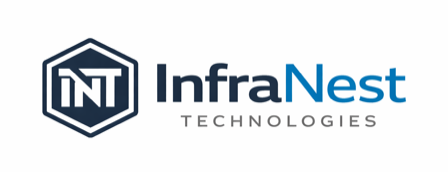

<!-- Placeholder logo — replace with the official InfraNest logo when ready -->

  

<h1 align="center">InfraNest Technologies</h1>

Modern IT operations, cloud, and workplace technology solutions.

---

## Overview

This repository is the central codebase for InfraNest Technologies. It currently hosts the company's public website, which introduces InfraNest's services and helps potential clients get in touch or request a quote.

## Why this project exists

InfraNest helps businesses with IT operations, cloud infrastructure, and workplace technology. The website's job is simple: explain what InfraNest offers, build trust with visitors, and turn interested visitors into leads through contact and quote request forms.

## What's included

- **`sandbox-infrastructure/`** — the InfraNest marketing website. See [its README](sandbox-infrastructure/README.md) for setup and local development instructions, and [its CLAUDE.md](sandbox-infrastructure/CLAUDE.md) for a deeper technical/architecture reference.

This repository is structured to support additional applications and services over time as InfraNest grows.

## Key capabilities

- A multi-page marketing site covering services, company background, and contact info
- A contact form and a quote request form for capturing new leads
- Spam and bot protection on both forms
- Automatic email notifications when someone submits a form

## Getting started

To run the website locally, see the setup instructions in [`sandbox-infrastructure/README.md`](sandbox-infrastructure/README.md).
